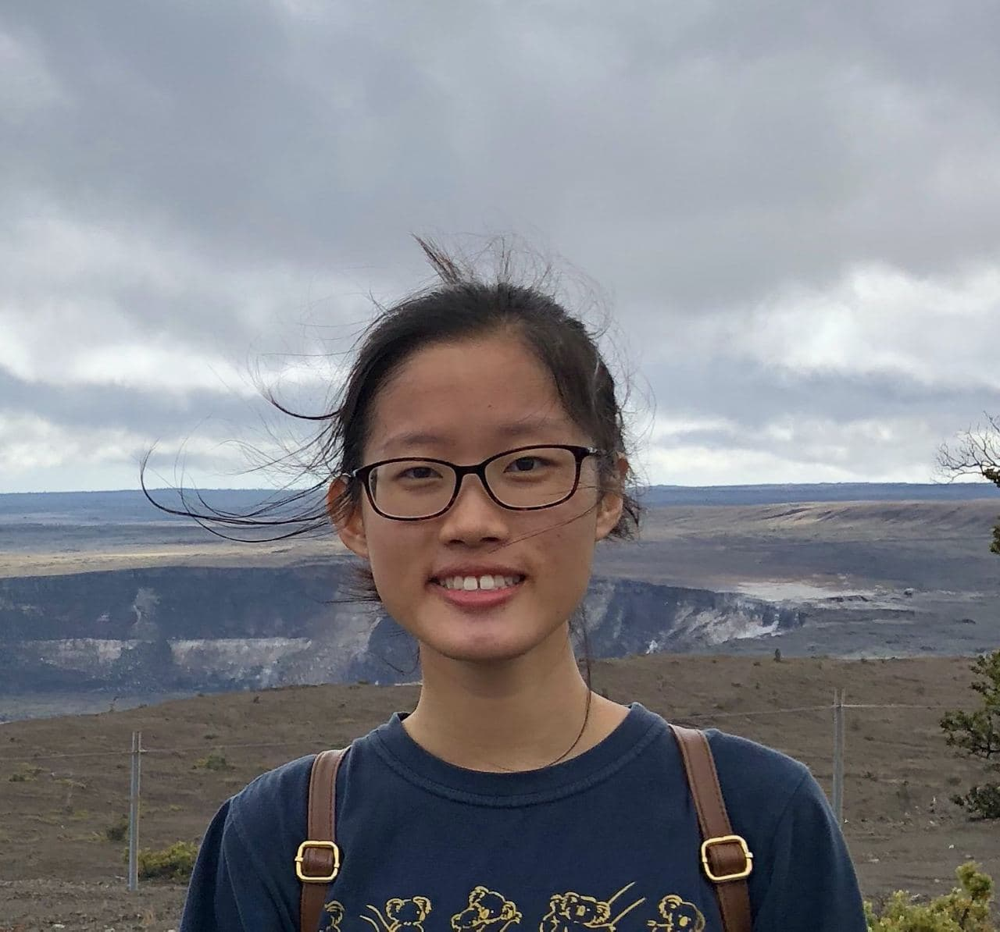
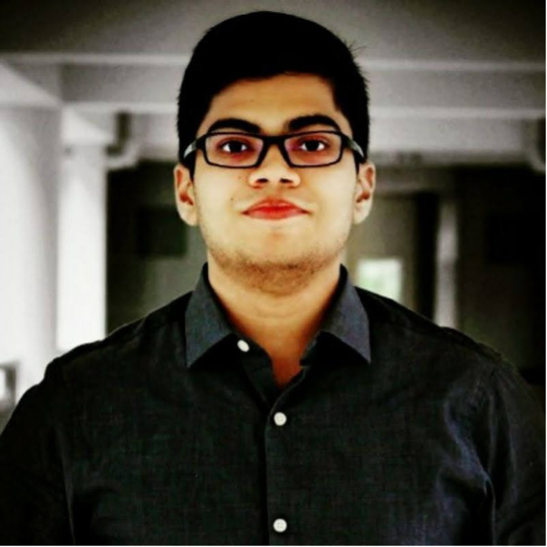
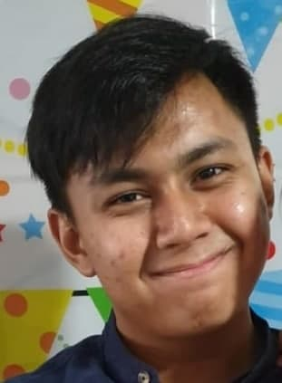
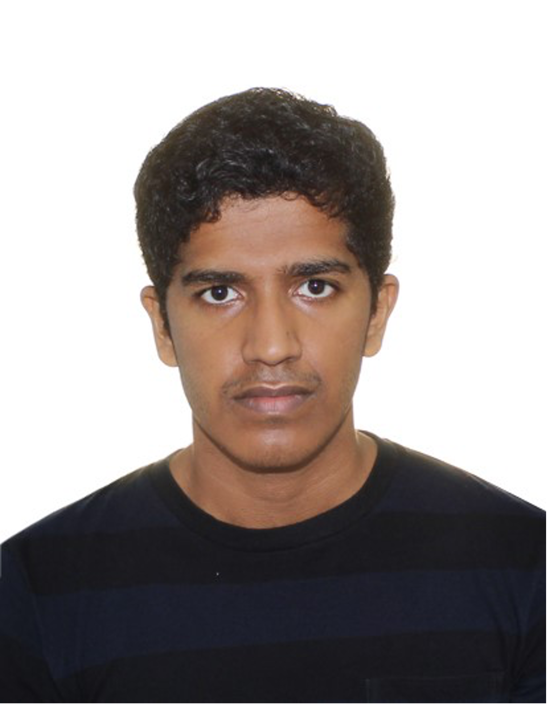
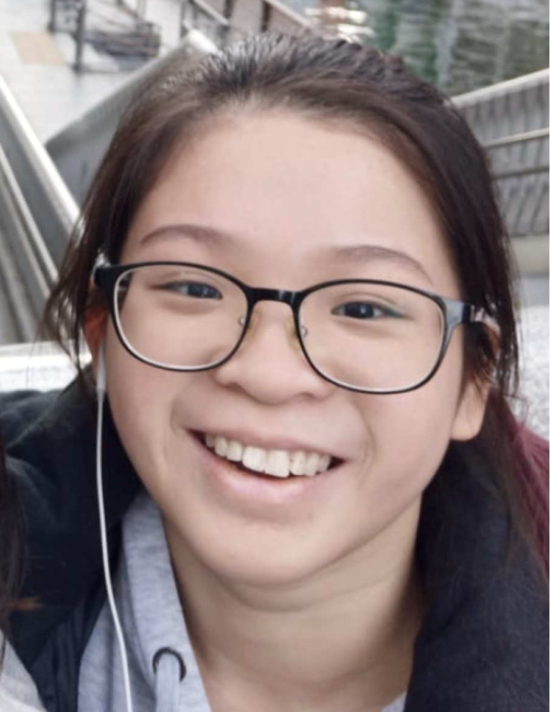

We are a team based in the [School of Computing, National University of Singapore](http://www.comp.nus.edu.sg).

You can reach us at the email `seer[at]comp.nus.edu.sg`

## Project team

### Han Geng Ning

[[github](http://github.com/zognin)]
[[portfolio](team/zognin.md)]

* Role: Team Lead
* Responsibilities: Scheduling and tracking

### Ruppa Nagarajan Sivayoga Subramanian

[[github](http://github.com/sivayogasubramanian)] [[portfolio](team/sivayogasubramanian.md)]

* Role: Developer
* Responsibilities: Testing, Integration

### Muhammad Imran Bin Ridzuan

[[github](http://github.com/Imranr2)]
[[portfolio](team/imranr2.md)]

* Role: Developer
* Responsibilities: Deliverables and deadlines, Documentation, Testing

### Manoharan Ajay Anand

[[github](http://github.com/Manoharan-Ajay-Anand)]
[[portfolio](team/manoharan-ajay-anand.md)]

* Role: Developer
* Responsibilities: Code quality

### Sim Sing Yee, Eunice

[[github](http://github.com/EuniceSim142)]
[[portfolio](team/eunicesim142.md)]

* Role: Developer
* Responsibilities: Documentation, Code quality
