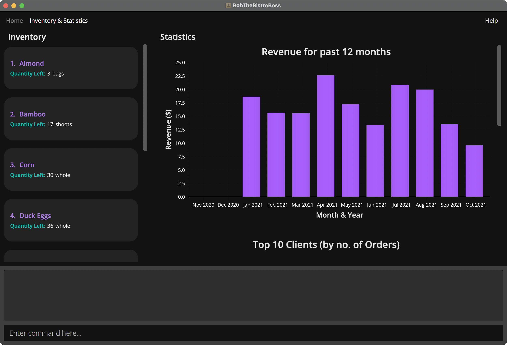
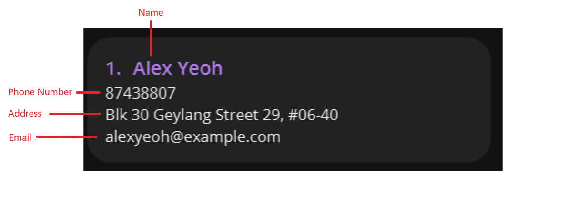
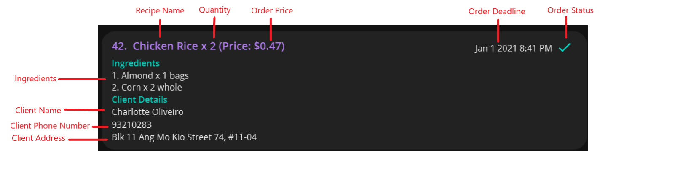
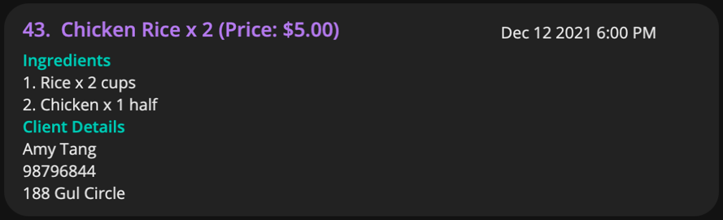
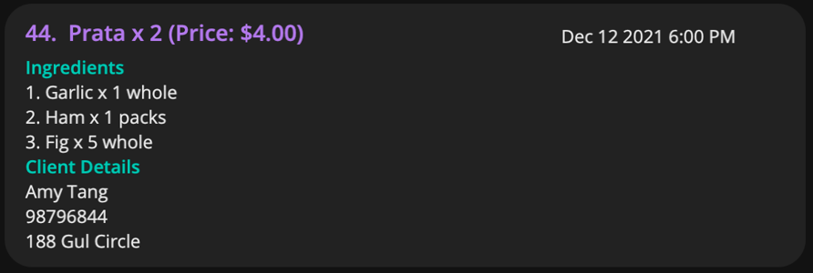
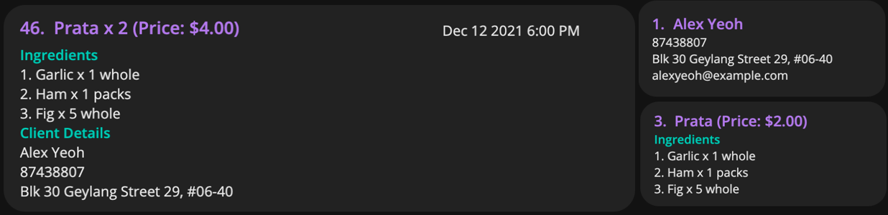
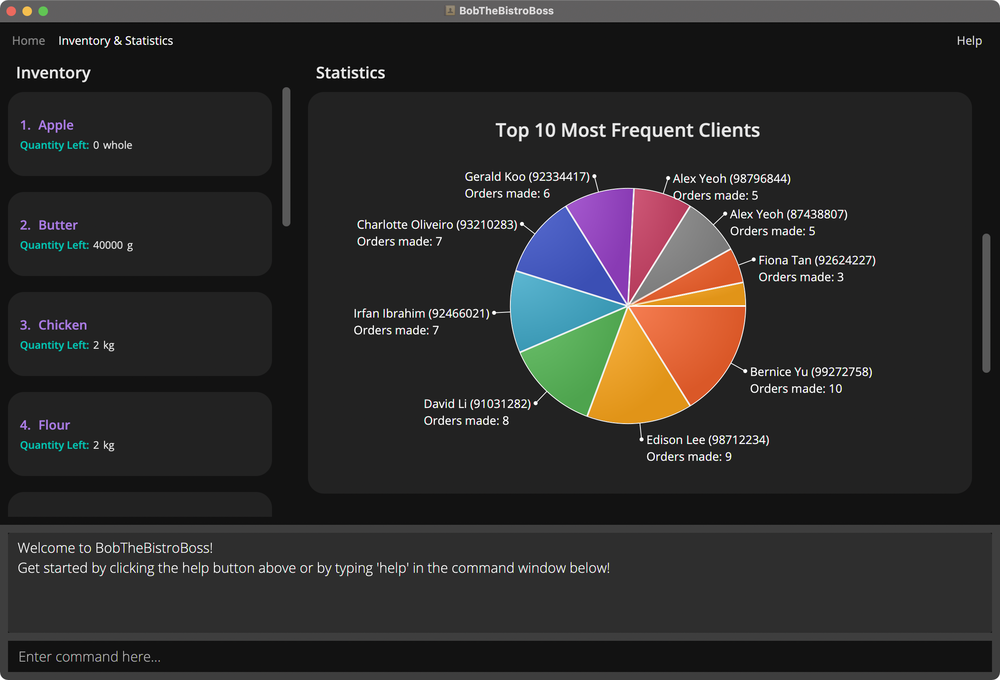
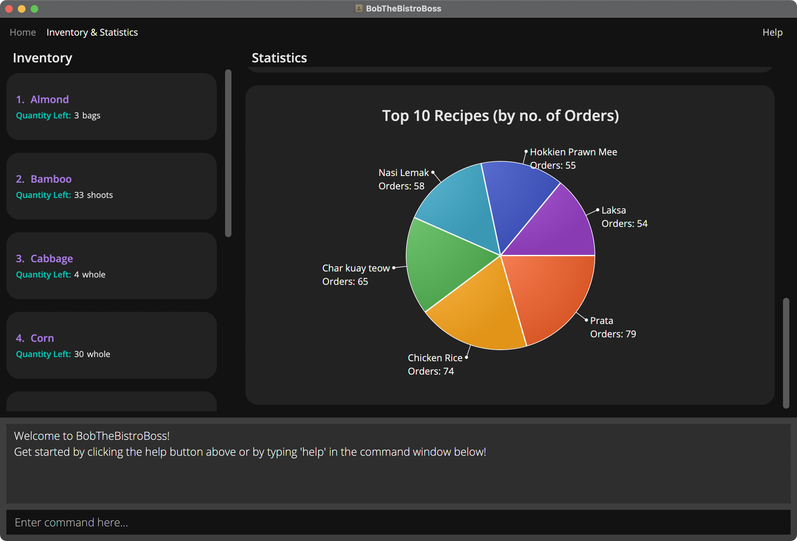

### Introducing BobTheBistroBoss

Do you face difficulties managing many orders?  
Ever wanted to stop worrying about your next inventory restock?  
Thought about hiring someone to manage the growth of your home business?  

If any of these concerns apply to you, then you're in luck –– **BobTheBistroBoss** can do all these and MORE!  
Not only that, BobTheBistroBoss (BTBB) makes this process **hassle-free**!  
Allow BTBB to handle the business, while you focus on being the next Gordon Ramsay!

BTBB supports Home Chefs who seek to **venture into the home-based F&B business**, but are deterred by the complexity of business management.

With BTBB, you can **track logistics** and receive valuable **data visualizations** via a **user-friendly** command line interface (CLI).
BTBB consolidates all the data in one place, and even comes with a Graphical User Interface (GUI) to easily view
and manoeuvre through client, ingredient, order and recipe details.

### Navigating the user guide

This user guide aims to equip you with the necessary knowledge so that you can fully utilize BTBB.

If you have yet to install the application, head to [Quick start](#2-quick-start) to get started!

[Overview of Features](#3-overview-of-features) will help you to get a high level overview of what
features are available in BTBB. For more in depth information on the available features, head to
[Features](#4-features).

If you have any questions regarding BTBB, check out [FAQ](#5-faq) for answers to frequently asked questions.

[Disclaimers](#6-disclaimers) contains general disclaimers for our app such as restrictions on inputs and
additional details regarding the command format. **It is important for you to read this section
so that you are aware about these restrictions and additional details.**

Lastly, if you are an experienced user that is looking for a refresher on the available commands, do check out
[Command Summary](#7-command-summary) for a summary of all the commands that BTBB currently supports.

`Words or phrases in code blocks like this are for user inputs or input parameters.`

--------------------------------------------------------------------------------------------------------------------

<!--
@@author {sivayogasubramanian}-reused
Reused from https://github.com/AY2021S1-CS2103T-W16-3/tp/pull/179/commits/aec461182c194c9ca2c67d7c407fcabb376191ff
-->

## 1. Table of Contents

  * Table of Contents
  {:toc}

--------------------------------------------------------------------------------------------------------------------

## 2. Quick start

### 2.1 Installation

1. Ensure you have Java version 11 or above installed in your Computer. You may install the latest version of Java [here](https://www.oracle.com/java/technologies/downloads/).

2. You can download the latest jar file from our [releases page](https://github.com/AY2122S1-CS2103T-W16-2/tp/releases).

3. Copy the jar file to an empty folder. This will be your _home folder_ for BTBB.

4. You can launch BobTheBistroBoss by double-clicking on the jar file.

### 2.2 Layout

The user interface of BobTheBistroBoss is divided into 2 tabs.

#### 2.2.1 Home Tab

Displays [orders](#33-orders), [client bookmarks](#31-client-bookmarks) and [recipe bookmarks](#34-recipe-bookmarks).

Fig 1. Home tab
{:.caption}

#### 2.2.2 Inventory & Statistics Tab

Displays [inventory](#32-inventory) and [statistics](#35-statistics).

Fig 2. Inventory & Statistics tab
{:.caption}

### 2.3 Creating your first order

This is a step-by-step guide to help you get started in creating your first order.
If you have not installed BobTheBistroBoss, you may do so by following the instructions [here](#21-installation).

For this guide, we will simulate the following scenario:

Your regular customer John Doe wishes to place two orders, one on 10 December 2021 and the other on 11 December 2021.
Both of these orders are to be delivered at 12pm. For both of these orders, he will require 3 tuna sandwiches. Each
tuna sandwich will be priced at $2.

Here are the details of John Doe:
* Name: John Doe
* Phone Number: 92345678
* Email: johndoe@gmail.com
* Address: Blk 422, Bedok North Road, #15-25

Here are the ingredients that will be used for the tuna sandwich:

* 2 slices of bread
* 1 slice of cheese
* 1 can of tuna

Suppose you currently have these ingredients with you:

* 100 slices of bread
* 100 slices of cheese
* 100 cans of tuna

#### 2.3.1 Approach 1

We can proceed to add the first order on 10 December 2021 by entering the following
command in the command box at the bottom of the app:

`add-o cn/John Doe cp/92345678 ca/Blk 422, Bedok North Road, #15-25 rn/Tuna Sandwich ri/Bread-2-slices, Cheese-1-slices, Tuna-1-cans op/6 oq/3 od/10-12-2021 1200`

You will notice that the order has been added to the Orders list (orders are sorted by deadline and are grouped by their completion status).
However, this is not the recommended approach, especially for repeated orders, as it can be very inefficient. Furthermore, this approach does
not allow you to track ingredients in your inventory. We will now add the second order using our recommended approach.

#### 2.3.2 Approach 2 (Recommended)

Firstly, switch over to the Inventory & Statistics tab by entering the following command:

`tab 2`

Remember the ingredients you had? After your first order, you will be left with 94 slices of bread, 97 slices of
cheese and 97 cans of tuna. We will proceed to add them to the inventory by entering the following commands:

`add-i in/Bread iq/94 iu/slices`

`add-i in/Cheese iq/97 iu/slices`

`add-i in/Tuna iq/97 iu/cans`

You will notice that the ingredients, bread, cheese and tuna have been added to the Inventory list
(ingredients are sorted alphabetically).

Next, we will switch back to the Home tab by entering the following command:

`tab 1`

Let's start by adding our recipe to the Recipe Bookmarks list by entering the following command:

`add-r rn/Tuna Sandwich ri/Bread-2-slices, Cheese-1-slices, Tuna-1-cans rp/2`

You will notice that the recipe has been added to the Recipe Bookmarks list (recipes are sorted alphabetically). Take
note of the index of the recipe bookmark. We will refer to this index as `RECIPE_INDEX`.

Now, we will also add our client to the Client Bookmarks list by entering the following command:

`add-c cn/John Doe cp/92345678 ce/johndoe@gmail.com ca/Blk 422, Bedok North Road, #15-25`

You will notice that the client has been to the Client Bookmarks list (clients are sorted alphabetically). Take
note of the index of the client bookmark. We will refer to this index as `CLIENT_INDEX`.

Finally, we will add our order by entering the following command:

`add-o c/CLIENT_INDEX r/RECIPE_INDEX oq/3 od/11-12-2021 1200`

Replace `CLIENT_INDEX` and `RECIPE_INDEX` with the respective indexes you took note of in the
previous steps. You will notice that the order has been added to the Orders list. This approach is more efficient as
the client and recipe details are copied from their respective bookmarks into the order. If you switch
to the Inventory & Statistics tab, you will also notice how the quantities for the ingredients, tuna, sandwich and
cheese have been deducted allowing you to track your inventory. To learn more about the available commands, you may
head onto our [Features](#4-features) section.

--------------------------------------------------------------------------------------------------------------------

## 3. Overview of Features

### 3.1 Client (Bookmarks)
If you often sell meals to repeat clients, the client bookmarks feature will be useful.
Client bookmarks contain information like name, phone, email and address.
Some of these details can be copied to an order so that you do not have to type their information over and over again.

Do note that the **details are copied to the order, this means that editing a client bookmark will not edit
an order** that previously copied client details from it. This gives you flexibility to change details within an order
and client bookmark without affecting other orders and client bookmarks.
For example, if your usual client happens to have a different delivery address just for one order,
or if your client changes his phone number in the future, it will not affect records of past orders.

**:bookmark: Note:** 

* Client bookmarks are considered duplicates when they have the same phone number.

* You cannot have duplicate client bookmarks in the application.

* Client bookmarks may also be referred to as Clients for simplicity.

* Client bookmarks are sorted in ascending alphabetical order of client name.
  Uppercase letters appear before lowercase letters.

* You can use all client commands from any tab.

### 3.2 Inventory
As you probably need to handle many ingredients, the inventory helps you keep track of your stock.
It displays a list of ingredients whose quantities can be tracked.
When you create, edit or delete an order with ingredients,
the quantities of matching ingredients in your inventory will be adjusted accordingly.

Do note that the application currently allows you to track quantities from 0 to 40000
as stated in our [disclaimers](#65-quantities).
We believe that the range provided is sufficient for you to track your ingredients.
For example, once the quantity reaches 0, additional tracking may not be helpful
as you have to restock and will probably buy ingredients in bulk.
However, feel free to give us feedback for future iterations.

**:bookmark: Note:** 

* Ingredients are considered duplicates or matches when they have the same name and unit.
  The matching of name and unit are case-insensitive.

* You cannot have duplicate ingredients in the inventory.

* Ingredients in the inventory are sorted by ascending alphabetical order of ingredient name.
  Uppercase letters appear before lowercase letters.

* You can use all ingredient commands from any tab.

### 3.3 Orders
The orders feature helps you manage your orders.
You can track client details, recipe details, order price, quantity, deadline and status with this feature.

**:bookmark: Note:** 

* Orders are considered duplicates when they have the same client details, recipe details, deadline and price.
  The matching of details are case-insensitive where applicable.

* You cannot have duplicate orders in the application.

* Orders are sorted by completion status, then deadline. Uncompleted orders appear before completed orders.
  Within each group of uncompleted and completed orders, orders with earlier deadlines are higher in the list.

* You can use all order commands from any tab.

### 3.4 Recipe (Bookmarks)
If you frequently receive orders for your signature dishes, the recipe bookmarks feature will be useful.
Recipe bookmarks contain information like name, ingredients and price.
These details can be copied over to an order so that you do not have to type these details over and over again.

Do note that the details are copied to the order,
this means that **editing a recipe bookmark will not edit an order** that previously copied recipe details from it.
This gives you flexibility to change details within an order without affecting other orders and recipe bookmarks.
For example if your client for an order has an allergy to peanuts, you can copy your usual recipe to the order and remove peanuts,
without affecting other orders that copied from the recipe before.
You can also change your recipe bookmarks, for example to increase its price, without affecting the integrity of past order records.

**:bookmark: Note:** 

* Recipe bookmarks are considered duplicates when they have the same name, ingredients and price.
  The matching of details are case-insensitive where applicable.

* You cannot have duplicate recipe bookmarks in the application.

* Recipe bookmarks may also be referred to as Recipes for simplicity.

* Recipe bookmarks are sorted by ascending alphabetical order of recipe name.
  Uppercase letters appear before lowercase letters.

* You can use all recipe commands from any tab.

### 3.5 Statistics
You may find it handy to track your business performance.
BTBB offers 3 types of statistics to help you with that!

They are:
* Revenue per month for the past 12 months.
* Top 10 most frequent clients, who made the most number of orders.
* Top 10 most popular recipes, that appear most frequently in all orders.

--------------------------------------------------------------------------------------------------------------------

## 4. Features

**:information_source: Notes about the command format:** 

* Words in `UPPER_CASE` are the parameters that are to be supplied by you. 
  e.g. in `add-o cn/CLIENT_NAME`, `CLIENT_NAME` is a parameter which can be used as `add-o cn/John Doe`.

* You may omit items in square brackets as they are optional. 
  e.g. `cn/CLIENT_NAME [ri/INGREDIENT_NAME-QUANTITY-UNIT, ...]` can be used as `cn/John Doe ri/Garlic-1-whole` or as
  `cn/John Doe`.

* You can provide the parameters in any order. 
  e.g. if the command specifies `cn/CLIENT_NAME cp/CLIENT_PHONE`, `cp/CLIENT_PHONE cn/CLIENT_NAME` is also acceptable.

* If a parameter is expected only once in the command, but you specified it multiple times, only the last occurrence
  of the parameter will be taken. 
  e.g. if you specify `cp/12341234 cp/56785678`, only `cp/56785678` will be taken.

* Any extraneous parameters supplied by you for commands that do not take in parameters (such as `help`, and `list-c`) will be ignored. 
  e.g. if the command specifies `help 123`, it will be interpreted as `help`.

* You should note that the format of all date fields is `dd-MM-yyyy`. 
  e.g. 21-10-1998 is 21 October 1998.

* You should note that the format of all deadline fields is `dd-MM-yyyy HHmm`. 
  e.g. 21-10-1998 1830 is 21 October 1998 6.30pm.

* You should note that the format of all phone parameters is a series of up to 20 digits with no spacing between digits.

* You should note that address parameters have no restrictions on their format. But they should contain at least one non-space character.

* You should note that the following parameters allow up to 50 characters (including spaces):
  * Client Name
  * Ingredient Name
  * Order Name
  * Recipe Name
  * Ingredient Unit

### 4.1 Viewing help : `help`

Don't know how to start using the application? This command displays a help window with the URL to BTBB's User Guide.

Format: `help`

### 4.2 Switching Tabs: `tab`

You can easily switch to the specified tab using this command.

Format: `tab INDEX`

* Switches to the tab corresponding to the specified INDEX. INDEX must be either 1 or 2.
  * Index 1 corresponds to the Home tab.
  * Index 2 corresponds to the Inventory & Statistics tab.

**Examples:**
* `tab 1` Switches to the Home tab.

### 4.3 Client

Fig 3. Parts of a client
{:.caption}

#### 4.3.1 Adding a client: `add-c`

You can add a client to the application using this command.

Format: `add-c cn/NAME cp/PHONE ce/EMAIL ca/ADDRESS`

**:bookmark: Note:** 

* Client bookmarks are considered duplicates when they have the same `PHONE`.

* <code>cp/PHONE</code> refers to a client's phone number and is unique to a client. Each phone number in the system
  must belong to exactly one client.

**Examples:**
* `add-c cn/Alex Yeoh cp/89653101 ce/alexyeoh@gmail.com ca/Choa Chu Kang St 62 Blk 123 #12-34` Adds a client with the
  following attributes:
  * Name: Alex Yeoh
  * Phone number: 89653101
  * Email: alexyeoh@gmail.com
  * Address: Choa Chu Kang St 62 Blk 123 #12-34

#### 4.3.2 Deleting a client: `delete-c`

You can delete a client from the application using this command.

Format: `delete-c INDEX`

**:bookmark: Note:** 

* `INDEX` allows you to choose which client to delete by specifying its position in the currently displayed client list.

**Examples:**
* `delete-c 1` Deletes the client at index 1 in the client list currently shown.

#### 4.3.3 Editing a client: `edit-c`

You can edit an existing client in the application using this command.

Format: `edit-c INDEX [cn/NAME] [cp/PHONE] [ce/EMAIL] [ca/ADDRESS]`

**:bookmark: Note:** 

* `INDEX` allows you to choose which client to edit by specifying its position in the currently displayed client list.

* `[cn/NAME], [cp/PHONE], [ce/EMAIL], [ca/ADDRESS]` allows you to specify the client information to update. None of
  them are mandatory, but at least one must be specified.

* The updated client must not be a duplicate of another existing client in the client bookmarks.  
  i.e. Updated client and the other existing client must not have the same `PHONE`.

* **Editing a client will not edit an order** that previously copied details from the client.
  Refer to [this explanation](#31-client-bookmarks) for a better understanding.

**Examples:**
*  `edit-c 3 cn/Amy ce/Amy1234@gmail.com` Edits the third client in the currently shown client list by changing the
   name to 'Amy' and the email to 'Amy1234@gmail.com'.

#### 4.3.4 Finding clients by keywords: `find-c`

You can find client(s) whose attribute(s) match the keyword(s) using this command.

Format: `find-c [cn/NAME] [cp/PHONE] [ce/EMAIL] [ca/ADDRESS]`

**:bookmark: Note:** 

* You should note that the search is case-insensitive.

* You must supply 1 or more search arguments.

* You can specify multiple search keywords for each field.  
  e.g. <code>find-c cn/Alex Brian</code>

* You should note that partial search is allowed.  
  e.g. <code>find-c cn/Al</code> can show orders for clients with names like Alice and Alex.

* You should note that this command will find clients that match at least one keyword, for each prefix.

**Examples:**
* `find-c cn/al` Finds clients with names containing 'al'. E.g. **Al**ex, Abig**al**e.
* `find-c cp/22312` Finds clients with phone numbers containing 22312. E.g. 9**22312**11.
* `find-c cn/Al Ice cp/9123 923111` Finds clients whose name and phone contains at least 1 of the
  keywords for each prefix. Any client with the following details will be matched:
  * **Al**ex **9123**1100
  * Bern**ice** 98**9123**45
  * **Al**ex **923111**97
  * Bern**ice** 91**923111**

#### 4.3.5 Listing all clients: `list-c`

You can list all clients in the application using this command.

Format: `list-c`

### 4.4 Ingredient

Fig 4. Parts of an ingredient
{:.caption}

#### 4.4.1 Adding an ingredient: `add-i`

You can add an ingredient to the application using this command.

Format: `add-i in/NAME iq/QUANTITY iu/UNIT`

**:bookmark: Note:** 

* You should note that the application does not allow duplicate ingredients to be added.

* An ingredient is considered a duplicate if it has the same `NAME` and `UNIT` as an existing ingredient in the
  application.

* The matching of `NAME` and `UNIT` are case-insensitive.

* The `QUANTITY` supplied by you must be positive, and the largest possible input is 40000.

**Examples:**
* `add-i in/White Rice iq/4000 iu/g` Adds 4000g of White Rice to the Inventory.

#### 4.4.2 Deleting an ingredient: `delete-i`

You can delete an ingredient from the application using this command.

Format: `delete-i INDEX`

**:bookmark: Note:** 

* `INDEX` allows you to choose which ingredient to delete by specifying its position in the currently displayed inventory.

**Examples:**
* `delete-i 1` Deletes the ingredient at index 1 in the ingredient list currently shown.

#### 4.4.3 Editing an ingredient: `edit-i`

You can edit an existing ingredient in the application using this command.

Format: `edit-i INDEX [in/NAME] [iq/QUANTITY] [iu/UNIT]`

**:bookmark: Note:** 

* `INDEX` allows you to choose which ingredient to edit by specifying its position in the currently displayed inventory.

* `[in/NAME], [iq/QUANTITY], [iu/UNIT]` allows you to specify the ingredient information to update. None of
  them are mandatory, but at least one must be specified.

* The updated ingredient must not be a duplicate of another existing ingredient in the inventory.  
  i.e. Updated ingredient and the other existing ingredient must not have the same `NAME` and `UNIT`.

**Examples:**
*  `edit-i 2 in/Apple iu/whole` Edits the second ingredient in currently shown ingredient list by changing the
   name to 'Apple' and the unit to 'whole'.

#### 4.4.4 Finding ingredients by keywords: `find-i`

You can find ingredient(s) whose attribute(s) match the keyword(s) using this command.

Format: `find-i [in/NAME] [iq/QUANTITY] [iqf/QUANTITY_FROM] [iqt/QUANTITY_TO] [iu/UNIT]`

**:bookmark: Note:** 

* You should note that the search is case-insensitive.

* You must supply 1 or more search arguments.

* You can specify multiple search keywords for each field.  
  e.g. <code>find-i in/Kiwi Chocolate</code>

* You should note that partial search is allowed.  
  e.g. <code>find-i in/Ap</code> can show ingredients with names like Apple and Apricot.

* You should note that this command will find ingredients that match at least one keyword, for each prefix.

* Ingredient `QUANTITY`:
  * keywords for `QUANTITY` finds ingredients with a quantity that is equal to any of the given keywords.
  * keywords for `QUANTITY_FROM `and `QUANTITY_TO` finds ingredients with a quantity in the range, inclusive of
    `QUANTITY_FROM` and `QUANTITY_TO`.
  * If keywords are given for `QUANTITY`, `QUANTITY_FROM` and `QUANTITY_TO`, then the matching ingredients found will
    satisfy all 3 conditions.

**Examples:**
* `find-i in/co` Finds ingredients with names containing 'co'. E.g. **Co**rn, Ba**co**n.
* `find-i iq/20 33` Finds ingredients with quantities equal to 20 or 33.
* `find-i in/co eg iqf/7 iqt/19 iu/g` Finds ingredients with name and unit containing at least 1 of the keywords for
  each prefix, and quantity in the specified range.
  These ingredients with the following details will be matched:
  * **Co**rn **7** **g**rams
  * **Eg**g **19** k**g**
  * V**eg**etable Oil **14** **g**

#### 4.4.5 Listing all ingredients: `list-i`

You can list all ingredients in the application using this command.

Format: `list-i`

### 4.5 Order

Fig 5. Parts of an order
{:.caption}

**:bookmark: Note:** 

* If an order is not completed, the tick for completion status will not be shown.

#### 4.5.1 Adding an order: `add-o`

You can add an order to the application using this command.

You can use any of the following command formats to add an order:
1. All client and recipe details specified:  
  `add-o cn/CLIENT_NAME cp/CLIENT_PHONE ca/CLIENT_ADDRESS
  rn/RECIPE_NAME [ri/INGREDIENT_NAME-QUANTITY-UNIT, ...] op/ORDER_PRICE od/ORDER_DEADLINE [oq/ORDER_QUANTITY]`

1. Only client index used (must provide recipe details):  
  `add-o c/CLIENT_INDEX [cn/CLIENT_NAME] [cp/CLIENT_PHONE] [ca/CLIENT_ADDRESS]
  rn/RECIPE_NAME [ri/INGREDIENT_NAME-QUANTITY-UNIT, ...] op/ORDER_PRICE od/ORDER_DEADLINE [oq/ORDER_QUANTITY]`

1. Only recipe index used (must provide client details):  
  `add-o cn/CLIENT_NAME cp/CLIENT_PHONE ca/CLIENT_ADDRESS r/RECIPE_INDEX [rn/RECIPE_NAME]
  [ri/INGREDIENT_NAME-QUANTITY-UNIT, ...] [op/ORDER_PRICE] od/ORDER_DEADLINE [oq/ORDER_QUANTITY]`

1. Both client and recipe indexes used:  
  `add-o c/CLIENT_INDEX [cn/CLIENT_NAME] [cp/CLIENT_PHONE] [ca/CLIENT_ADDRESS] r/RECIPE_INDEX
  [rn/RECIPE_NAME] [ri/INGREDIENT_NAME-QUANTITY-UNIT, ...] [op/ORDER_PRICE] od/ORDER_DEADLINE [oq/ORDER_QUANTITY]`

**:bookmark: Note:** 

* `od/ORDER_DEADLINE` includes date and time, it must follow the format specified [above](#4-features).

**Client details** include client name, phone and address, they must be provided in one of these ways:
* If `c/CLIENT_INDEX` is provided (Format 2 and 4),
  * client details are copied from the client bookmark at the given index to the order.
  * If `cn/`, `cp/` or `ca/` are provided with `c/`, the respective client detail is taken from `cn/`, `cp/` or `ca/` instead.
* If `c/CLIENT_INDEX` is not provided (Format 1 and 3),
  * `cn/`, `cp/` and `ca/` must be provided.

**Recipe details** include recipe name, ingredients and price. Recipe name and order price must be provided in one of these ways:
* If `r/RECIPE_INDEX` is provided (Format 3 and 4),
  * recipe details are copied from the recipe bookmark at the given index to the order.
  * `ORDER_PRICE` is calculated by multiplying the copied `RECIPE_PRICE` with `QUANTITY` of the order.
  * If `rn/`, `ri/` or `op/` is provided with `r/`, the respective recipe detail is taken from `rn/`, `ri/` or `op/` instead.
* If `r/` is not provided (Format 1 and 2),
  * `rn/` and `op/` must be provided.

These details are fully optional:
* `oq/ORDER_QUANTITY` is set to 1 by default, if not specified.
* `ri/INGREDIENT_NAME-QUANTITY-UNIT, ...` does not need to be specified.

Secondary processes that happen when you add an order:
* For each ingredient in the order, the inventory will find [matching ingredients](#32-inventory) and decrease their quantity.
  The inventory quantity is decreased by the ingredient quantity in the order, multiplied by the order quantity.
  If the ingredient in the order does not exist in the inventory, there is no effect.
* All orders have an uncompleted status upon addition.

**When an order is added with one or more ingredients that are tracked in the inventory,
the application will still allow the addition of an order even if the ingredient quantities are not enough to fulfil the order.
It is your responsibility to keep the inventory restocked so that our ingredient tracking works as intended.
Please read our [disclaimers about ingredient quantities](#65-quantities) to learn more.**

**Examples:**
* `add-o cn/Amy Tang cp/98796844 ca/188 Gul Circle rn/Chicken Rice ri/Rice-2-cups, Chicken-1-half op/5.00 od/12-12-2021
  1800 oq/2` Adds an order, without using client index and recipe index. (Format 1)

Fig 6. Format 1: Adding an order without client index and recipe index
{:.caption}

* `add-o c/1 rn/Chicken Rice ri/Rice-2-cups, Chicken-1-half op/5.00 od/12-12-2021 1800 oq/2` Adds an order using a client index. (Format 2)

Fig 7. Format 2: Adding an order using a client index
{:.caption}

* `add-o cn/Amy Tang cp/98796844 ca/188 Gul Circle r/3 od/12-12-2021 1800 oq/2` Adds an order using a recipe index. (Format 3)

Fig 8. Format 3: Adding an order using a recipe index
{:.caption}

* `add-o c/1 r/3 od/12-12-2021 1800 oq/2` Adds an order using both client and recipe indexes. (Format 4)

Fig 9. Format 4: Adding an order using both client and recipe indexes
{:.caption}

#### 4.5.2 Adding an order ingredient: `add-oi`

You can add an ingredient to an order in the application using this command.

Format: `add-oi INDEX in/INGREDIENT_NAME iq/INGREDIENT_QUANTITY iu/INGREDIENT_UNIT`

**:bookmark: Note:** 

* `INDEX` allows you to choose which order to add ingredients to by specifying its position in the currently displayed
  order list.

* An ingredient already exists in an order if it has the same `NAME` and `UNIT` as an existing ingredient in the order's ingredient sub-list.

* Ingredients that already exist in the order cannot be added again. Instead, you should perform delete order ingredient command
  before performing this command again.

* If the added ingredient [exists in the inventory](#32-inventory), the quantity deducted from
  the inventory will be equivalent to the ingredient quantity in the order multiplied by the order quantity.

**When an order ingredient is added to the order with an ingredient that is tracked in the inventory,
the application will still allow the addition of the order ingredient even if the ingredient quantity is not enough to fulfil the order.
It is your responsibility to keep the inventory restocked so that our tracking works as intended.
Please read our [disclaimers about ingredient quantities](#65-quantities) to learn more.**

**Examples:**
* `add-oi 1 in/Rice iq/400 iu/g` Adds 400 g of Rice to the ingredients of the first order.

#### 4.5.3 Deleting an order: `delete-o`

You can delete an order from the application using this command.

Format: `delete-o INDEX`

**:bookmark: Note:** 

* `INDEX` allows you to choose which order to delete by specifying its position in the currently displayed order list.

* When an order is deleted from the list, its ingredient quantities are added back to matching ingredients in the inventory. However, if the
  order is already marked as done, its ingredient quantities will not be added back.

**When an order with ingredients that are tracked in the inventory is deleted,
the application will still allow the deletion of the order even if any of the ingredient quantities has reached the upper limit of 40000.
We believe that the upper limit of the ingredient quantity is sufficient for normal use.
If there is a need to change the quantity above the limit, consider changing the ingredient unit instead.
Please read our [disclaimers about ingredient quantities](#65-quantities) to learn more.**

**Examples:**
* `delete-o 1` Deletes the order at index 1 in the order list currently shown.

#### 4.5.4 Deleting an order ingredient: `delete-oi`

You can delete an ingredient from an order in the application using this command.

Format: `delete-oi ORDER_INDEX i/INGREDIENT_INDEX`

**:bookmark: Note:** 

* `ORDER_INDEX` allows you to choose which order to delete ingredients from by specifying its position in the currently
  displayed order list.

* `INGREDIENT_INDEX` allows you to choose which ingredient to delete from the order by specifying its position in the
  currently displayed order ingredient sub-list.

* If the deleted ingredient [exists in the inventory](#32-inventory), the quantity added back to the inventory will
  be equivalent to the ingredient quantity in the order multiplied by the order quantity.

**When an order ingredient that is tracked in the inventory is deleted from the order,
the application will still allow the deletion of the order ingredient even if the ingredient quantity has reached the upper limit of 40000.
We believe that the upper limit of the ingredient quantity is sufficient for normal use.
If there is a need to change the quantity above the limit, consider changing the ingredient unit instead.
Please read our [disclaimers about ingredient quantities](#65-quantities) to learn more.**

**Examples:**
* `delete-oi 1 i/2` Deletes the second ingredient from the ingredient list of the first order.

#### 4.5.5 Editing an order: `edit-o`

You can edit an order in the application using this command.

Format: `edit-o INDEX [c/INDEX] [cn/CLIENT_NAME] [cp/CLIENT_PHONE] [ca/CLIENT_ADDRESS] [r/RECIPE_INDEX]
[rn/RECIPE_NAME] [op/ORDER_PRICE] [od/ORDER_DEADLINE] [oq/QUANTITY]`

**:bookmark: Note:** 

* `INDEX` allows you to choose which order to edit by specifying its position in the currently displayed order list.

* `[c/CLIENT_INDEX], [cn/CLIENT_NAME], [cp/CLIENT_PHONE], [ca/CLIENT_ADDRESS], [r/RECIPE_INDEX], [rn/RECIPE_NAME],
  [op/ORDER_PRICE], [od/DEADLINE], [oq/QUANTITY]` allows you to specify the order information to update. None of
  them are mandatory, but you must specify at least one.

* The updated order must not be a duplicate of another existing order in the orders list.  
  i.e. Updated order and the other existing order must not have the same client details, recipe details, `DEADLINE` and `PRICE`.

* To edit an order's ingredient list, refer to [Adding an order ingredient](#452-adding-an-order-ingredient-add-oi)
  and [Deleting an order ingredient](#454-deleting-an-order-ingredient-delete-oi).

**Examples:**

* `edit-o 1 cn/David` Edits the first order in the list currently shown by changing the client's name to David.
* `edit-o 2 cn/Carol cp/98765432` Edits the second order in the list currently shown by changing the client's name
  to Carol and the client's phone number to 98765432.

#### 4.5.6 Finding orders by keywords: `find-o`

You can find order(s) with attribute(s) that contains the keyword(s) using this command.

Format: `find-o [cn/CLIENT_NAME] [cp/CLIENT_PHONE] [ca/CLIENT_ADDRESS] [rn/RECIPE_NAME] [od/ORDER_DATE] [of/YES_OR_NO]`

**:bookmark: Note:** 

* You should note that the search is case-insensitive.

* You must supply 1 or more search arguments.

* You can specify multiple search keywords for each field.  
  e.g. <code>find-o cn/Alex Brian</code>

* You should note that partial search is allowed.  
  e.g. <code>find-o cn/Al</code> can show orders for clients with names like Alice and Alex.

* You should note that this command will find orders that match at least one keyword, for each prefix.

* `od/ORDER_DATE` represents the order date. They must follow the format specified [above](#4-features).

* `of/YES_OR_NO` represents whether the order is completed.

**Examples:**
* `find-o cn/al` Finds orders for clients with names containing 'al'. E.g. **Al**ex, K**al**yn.
* `find-o cp/91234567` Finds orders for clients with phone numbers that contain 91234567. E.g. **91234567**,
  87**91234567**3421
* `find-o cn/Alex David cp/9123 9231` Finds orders for clients whose name and phone contains at least 1 of the
  keywords for each prefix. Any orders with the following client details will be matched:
  * **Alex** **9123**1100
  * **David** 8912**9123**
  * **Alex** 9881**9231**
  * **David** **9231**6612

#### 4.5.7 Listing all orders: `list-o`

You can list all orders in the application using this command.

Format: `list-o`

#### 4.5.8 Marking an order as done: `done-o`

You can mark an order as done once it has been delivered to the client using this command.

Format: `done-o INDEX`

**:bookmark: Note:** 

* `INDEX` allows you to choose which order to mark as done by specifying its position in the currently displayed order list.

**Examples:**
* `done-o 1` Marks the order at index 1 in the order list currently shown as done.

#### 4.5.9 Marking an order as undone: `undone-o`

You can mark an order as undone using this command.

Format: `undone-o INDEX`

**:bookmark: Note:** 

* `INDEX` allows you to choose which order to mark as undone by specifying its position in the currently displayed order list.

**Examples:**
* `undone-o 1` Marks the order at index 1 in the order list currently shown as undone.

### 4.6 Recipe

Fig 10. Parts of a recipe
{:.caption}

#### 4.6.1 Adding a recipe: `add-r`

You can add a recipe to the application using this command.

Format: `add-r rn/RECIPE_NAME [ri/INGREDIENT_NAME-QUANTITY_UNIT, ...] rp/RECIPE_PRICE`

**:bookmark: Note:** 

* The application does not allow duplicate recipes to be added.

* A recipe is considered a duplicate if it has the same `RECIPE_NAME`, list of ingredients and `RECIPE_PRICE` as an
  existing recipe in the application.

* The matching of fields are case-insensitive.

* `RECIPE_PRICE` should be positive and less than $2500.00.

**Examples:**
* `add-r rn/Soup ri/Carrot-2-Stick, Egg-1-Whole rp/2.00` Adds a recipe named Soup, with 2 ingredients and a price of
  $2.00.

#### 4.6.2 Adding a recipe ingredient: `add-ri`

You can add an ingredient to a recipe in the application using this command.

Format: `add-ri INDEX in/INGREDIENT_NAME iq/INGREDIENT_QUANTITY iu/INGREDIENT_UNIT`

**:bookmark: Note:** 

* `INDEX` allows you to choose which recipe to add ingredients to by specifying its position in the currently displayed
  recipe list.

* An ingredient already exists in the inventory if it has the same `NAME` and `UNIT` as an existing ingredient in the inventory.

* Ingredients that already exist in the recipe cannot be added again. Instead,
  perform delete recipe ingredient command first before performing this command again.

* Refer to [Inventory](#32-inventory) for the definition of a duplicate ingredient.

**Examples:**
* `add-ri 1 in/Rice iq/400 iu/g` Adds 400 g of Rice to the ingredient list of the first recipe.

#### 4.6.3 Deleting a recipe: `delete-r`

You can delete a recipe from the application using this command.

Format: `delete-r INDEX`

**:bookmark: Note:** 

* `INDEX` allows you to choose which recipe to delete by specifying its position in the currently displayed recipe list.

**Examples:**
* `delete-r 1` Deletes the recipe at index 1 in the recipe list currently shown.

#### 4.6.4 Deleting a recipe ingredient: `delete-ri`

You can delete an ingredient from a recipe in the application using this command.

Format: `delete-ri RECIPE_INDEX i/INGREDIENT_INDEX`

**:bookmark: Note:** 

* `RECIPE_INDEX` allows you to choose which recipe to delete ingredients from by specifying its position in the
  currently displayed recipe list.

* `INGREDIENT_INDEX` allows you to choose which ingredient to delete from the recipe by specifying its position in the
  currently displayed recipe ingredient sub-list.

**Examples:**
* `delete-ri 1 i/2` Deletes the second ingredient from the ingredient list of the first recipe.

#### 4.6.5 Editing a recipe: `edit-r`

You can edit an existing recipe in the application using this command.

Format: `edit-r INDEX [rn/RECIPE_NAME] [rp/RECIPE_PRICE]`

**:bookmark: Note:** 

* `INDEX` allows you to choose which recipe to edit by specifying its position in the currently displayed recipe list.

* `[rn/RECIPE_NAME], [rp/RECIPE_PRICE]` allows you to specify the recipe information to update. None of
  them are mandatory, but at least one must be specified.

* `RECIPE_PRICE` should be positive and less than $2500.00.

* The updated recipe must not be a duplicate of another existing recipe in the recipe bookmarks.  
  i.e. Updated recipe and the other existing recipe must not have the same `NAME`, list of ingredients and `PRICE`.

* To edit a recipe's ingredient list, refer to [Adding a recipe ingredient](#462-adding-a-recipe-ingredient-add-ri)
  and [Deleting a recipe ingredient](#464-deleting-a-recipe-ingredient-delete-ri).

* **Editing a recipe will not edit an order** that previously copied details from the recipe.
  Refer to [this explanation](#34-recipe-bookmarks) for a better understanding.

**Examples:**
*  `edit-r 2 rn/Burger rp/8` Edits the second recipe in the currently shown recipe list by changing the
   recipe name to 'Burger' and the recipe price to $8.00.

#### 4.6.6 Finding recipes by keywords: `find-r`

You can find recipe(s) with attribute(s) that contains the keyword(s) using this command.  
Recipes can only be found using recipe name.

Format: `find-r rn/RECIPE_NAME`

**:bookmark: Note:** 

* You should note that the search is case-insensitive.

* `rn/RECIPE_NAME` search field must be present.

* You can specify multiple search keywords for each field.  
  e.g. <code>find-r rn/Chicken rice</code>

* You should note that partial search is allowed.  
  e.g. <code>find-r rn/Ch</code> can show recipes with names like Chicken rice and Cheesecake.

**Examples:**
* `find-r rn/Chicken rice` Finds recipes with a name that contains at least 1 of the
  keywords for each prefix. Any recipes with the following names will be matched:
  * Teriyaki **Chicken**
  * **Chicken** **Rice**
  * Kimchi Fried **Rice**

#### 4.6.7 Listing all recipes: `list-r`

You can list all recipes in the application using this command.

Format: `list-r`

### 4.7 Statistics

#### 4.7.1 Viewing revenue per month for the past 12 months
* Your revenue earned per month for the past 12 months will be shown in a bar chart. Revenue is calculated only
  from completed orders.
* Values will be displayed when you hover your cursor over each bar.

Fig 11. Revenue bar chart
{:.caption}

#### 4.7.2 Viewing top 10 most frequent clients
* Your top 10 most frequent clients, who made the highest number of orders will be shown in a pie chart.
* To rank the frequency of clients, compare the number of orders each client made.  
  (e.g. Compare this sequence of orders: Amy ordered Chicken Rice x2, Bob ordered Fried Rice x4 and then Amy ordered Chicken Rice x1.  
  Amy is a more frequent client as she made more orders than Bob, regardless of the `ORDER_QUANTITY` for each order.)
* Ties are broken arbitrarily i.e. If there are multiple clients with the same number of orders, 10 random clients
  will be displayed.
* Values will be displayed when you hover your cursor over each wedge.

Fig 12. Client pie chart
{:.caption}

#### 4.7.3 Viewing top 10 most popular recipes
* Your top 10 most popular recipes, that appear most frequently in the all your orders will be shown in a pie chart.
* To rank the popularity of orders, compare the total order quantity of each recipe.  
  (e.g. Compare an order list with only these 3 orders: 'Chicken Rice x4', 'Fried Rice x2' and 'Fried Rice x1'  
  Chicken rice is more popular since its total quantity (sum of all `ORDER_QUANTITY`) is higher, i.e. 4 > 2+1.)
* Ties are broken arbitrarily i.e. If there are multiple recipes with the same number of order quantities, 10 random recipes
  will be displayed.
* Values will be displayed when you hover your cursor over each wedge.

Fig 13. Recipe pie chart
{:.caption}

### 4.8 Exiting the program: `exit`

You can exit the program using this command.

Format: `exit`

### 4.9 Saving the data

BTBB will save to the hard disk automatically after execution of any command that changes the data. There is no need
for you to save manually.

### 4.10 Editing the data file

BTBB saves its data as a JSON file. Advanced users are welcome to update the data directly by editing that data file.

:exclamation: **Caution:**
If your changes to the data file results in the format being invalid, BTBB will discard all data and start with an
empty data file at the next run.

--------------------------------------------------------------------------------------------------------------------

## 5. FAQ

**Q**: How do I transfer my data to another Computer? 
**A**: Install the application in the other computer and overwrite the empty data file it creates with the file that
contains the data of your previous BTBB home folder.

--------------------------------------------------------------------------------------------------------------------

## 6. Disclaimers

### 6.1 Data
* App starts with seed data if there is no initial data file.
* If you edit the JSON file with invalid data, the application
  will not show any data on startup.

### 6.2 Format
* For deadlines, 29-12-2021 2400 is considered valid, and it will be
  represented as 30-12-2021 0000 in the application.

### 6.3 Index
* When an `INDEX` directly after a command word has an incorrect format, the application displays the `Invalid Command Format!` error.  
  (e.g. edit-o -3)

* When an `INDEX` directly after a prefix is invalid, the application displays the `Invalid index. Index should be a positive whole number.` error.  
  (e.g. add-o c/-2 r/0 od/12-12-2022 1200)

### 6.4 Price
* Prices can be a whole number or a decimal value with **exactly** 2 decimal places.
* The largest possible recipe price is $2499.99.
* The largest possible order price is $99,999,999.99.
* Changes made to an existing order's quantity will not update the order price.  
  (e.g. For an existing order of 1 Apple Pie, priced at $5,
  if the order has been edited to 2 Apple Pies, the price of the order remains at $5.)

### 6.5 Quantities
* If you change any quantity field in orders in the JSON file, the
  application will not automatically reflect the corresponding changes
  in the inventory.
* Ingredient quantity cannot change beyond the lower boundary of 0
  and the upper boundary of 40000.  
  (e.g. If the user reaches the upper boundary and tries to increase
  the quantity further by deleting an existing order that uses the
  ingredient, the system will allow the deletion but inventory no
  longer tracks the ingredient properly.)

### 6.6 Restrictions
* A Phone number allows up to 20 digits.

* The following parameters allow up to 50 characters (including whitespace):
  * Client Name
  * Ingredient Name
  * Order Name
  * Recipe Name
  * Ingredient Unit

--------------------------------------------------------------------------------------------------------------------

## 7. Command summary

Action                      | Format
----------------------------|------------------------------------------------------------------------------------------------------------------------------------------------------------------------------------------
**Add client**              | `add-c cn/NAME cp/PHONE ce/EMAIL ca/ADDRESS`
**Delete client**           | `delete-c INDEX`
**Edit client**             | `edit-c INDEX [cn/NAME] [cp/PHONE] [ce/EMAIL] [ca/ADDRESS]`
**Find client**             | `find-c [cn/NAME] [cp/PHONE] [ce/EMAIL] [ca/ADDRESS]`
**List client**             | `list-c`
**Add ingredient**          | `add-i in/NAME iq/QUANTITY iu/UNIT`
**Delete ingredient**       | `delete-i INDEX`
**Edit ingredient**         | `edit-i INDEX [in/NAME] [iq/QUANTITY] [iu/UNIT]`
**Find ingredient**         | `find-i [in/NAME] [iq/QUANTITY] [iqf/QUANTITY_FROM] [iqt/QUANTITY_TO] [iu/UNIT]`
**List ingredient**         | `list-i`
**Add order**               | 1. `add-o cn/CLIENT_NAME cp/CLIENT_PHONE ca/CLIENT_ADDRESS rn/RECIPE_NAME [ri/INGREDIENT_NAME-QUANTITY-UNIT, ...] op/ORDER_PRICE od/ORDER_DEADLINE [oq/ORDER_QUANTITY]`   2. `add-o c/CLIENT_INDEX [cn/CLIENT_NAME] [cp/CLIENT_PHONE] [ca/CLIENT_ADDRESS] rn/RECIPE_NAME [ri/INGREDIENT_NAME-QUANTITY-UNIT, ...] op/ORDER_PRICE od/ORDER_DEADLINE [oq/ORDER_QUANTITY]`   3. `add-o cn/CLIENT_NAME cp/CLIENT_PHONE ca/CLIENT_ADDRESS r/RECIPE_INDEX [rn/RECIPE_NAME] [ri/INGREDIENT_NAME-QUANTITY-UNIT, ...] [op/ORDER_PRICE] od/ORDER_DEADLINE [oq/ORDER_QUANTITY]`   4. `add-o c/CLIENT_INDEX [cn/CLIENT_NAME] [cp/CLIENT_PHONE] [ca/CLIENT_ADDRESS] r/RECIPE_INDEX [rn/RECIPE_NAME] [ri/INGREDIENT_NAME-QUANTITY-UNIT, ...] [op/ORDER_PRICE] od/ORDER_DEADLINE [oq/ORDER_QUANTITY]`
**Add order ingredient**    | `add-oi INDEX in/INGREDIENT_NAME iq/INGREDIENT_QUANTITY iu/INGREDIENT_UNIT`
**Delete order**            | `delete-o INDEX`
**Delete order ingredient** | `delete-oi ORDER_INDEX i/INGREDIENT_INDEX`
**Edit order**              | `edit-o INDEX [c/INDEX] [cn/CLIENT_NAME] [cp/CLIENT_PHONE] [ca/CLIENT_ADDRESS] [r/RECIPE_INDEX] [rn/RECIPE_NAME] [op/ORDER_PRICE] [od/ORDER_DEADLINE] [oq/QUANTITY]`
**Find order**              | `find-o [cn/CLIENT_NAME] [cp/CLIENT_PHONE] [ca/CLIENT_ADDRESS] [rn/RECIPE_NAME] [od/ORDER_DATE] [of/YES_OR_NO]`
**List order**              | `list-o`
**Mark order as done**      | `done-o INDEX`
**Mark order as undone**    | `undone-o INDEX`
**Add recipe**              | `add-r rn/RECIPE_NAME [ri/INGREDIENT_NAME-QUANTITY_UNIT, ...] rp/RECIPE_PRICE`
**Add recipe ingredient**   | `add-ri INDEX in/INGREDIENT_NAME iq/INGREDIENT_QUANTITY iu/INGREDIENT_UNIT`
**Delete recipe**           | `delete-r INDEX`
**Delete recipe ingredient**| `delete-ri RECIPE_INDEX i/INGREDIENT_INDEX`
**Edit recipe**             | `edit-r INDEX [rn/RECIPE_NAME] [rp/RECIPE_PRICE]`
**Find recipe**             | `find-r rn/RECIPE_NAME`
**List recipe**             | `list-r`
**Help**                    | `help`
**Tab**                     | `tab INDEX`
**Exit**                    | `exit`
