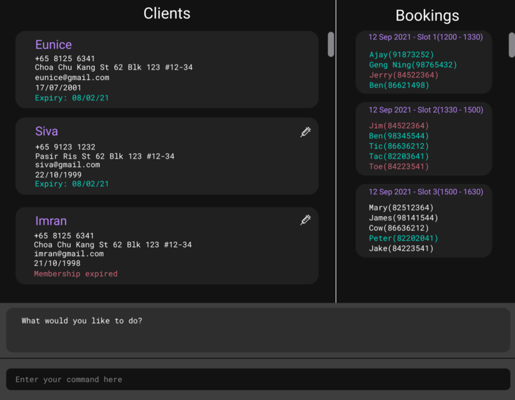

BobTheBistroBoss (BTBB) is a **desktop application for home chefs to manage their orders and inventory,
optimized for use via a command line interface (CLI)**.

* If you are interested in using BBTB, head over to the [_Quick Start_ section of the **User Guide**](UserGuide.html#quick-start).
* If you are interested about developing BBTB, the [**Developer Guide**](DeveloperGuide.html) is a good place to start.

**Acknowledgements**

This project is based on the AddressBook-Level3 project created by the [SE-EDU initiative](https://se-education.org).
* Libraries used: [JavaFX](https://openjfx.io/), [Jackson](https://github.com/FasterXML/jackson), [JUnit5](https://github.com/junit-team/junit5)
